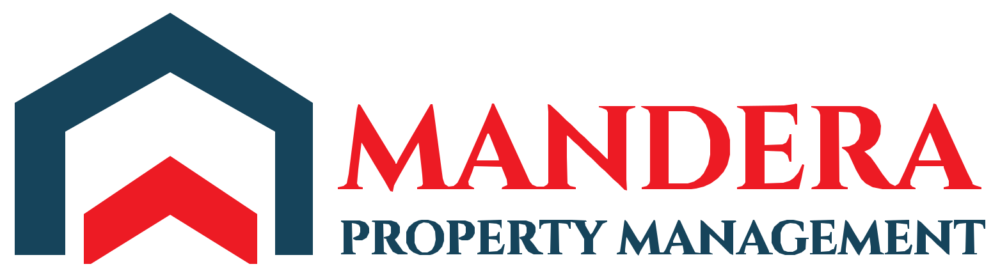

<p align="center">
  
</p>

<h1 align="center">Mandera Properties Management</h1>

<p align="center">
  Backend, admin dashboard, and mobile API for a multi-tenant property rental management platform.
</p>

<p align="center">
  
  
  
  
</p>

---

## Overview

Mandera is the backend and web control plane for property management companies. A single Next.js application serves two distinct clients:

| Client | Surface | Consumers |
|---|---|---|
| **Web dashboard** | Next.js pages + Server Actions | The platform's master admin — manages companies (owners), subscriptions, and revenue |
| **Mobile API** | Flat REST API under `/api/v1/*` | A separate Flutter app used by property companies — the manager and their team |

Each property company is represented by a `manager` account and any number of team members (`administrator`, `assistant`) sharing the same company scope, enforced end-to-end by Postgres Row Level Security. See [`docs/PROJECT_OVERVIEW.md`](docs/PROJECT_OVERVIEW.md) for the full roles/team model.

## Documentation

| Document | Covers |
|---|---|
| [`docs/PROJECT_OVERVIEW.md`](docs/PROJECT_OVERVIEW.md) | Roles, the team/rank model, architectural decisions |
| [`docs/API_REFERENCE.md`](docs/API_REFERENCE.md) | Current route map, auth/RLS model, database tables |
| [`public/openapi.yaml`](public/openapi.yaml) | The authoritative API contract, served live at `/api-docs` |
| [`docs/migrations/`](docs/migrations/) | Full, ordered history of every database schema change |

## Tech stack

- **Framework** — Next.js (App Router), TypeScript
- **Database / Auth / Storage** — Supabase (Postgres, RLS, Supabase Auth, Supabase Storage)
- **UI** — shadcn/ui, Tailwind CSS
- **API docs** — OpenAPI 3.0, rendered via Swagger UI at `/api-docs`

## Getting started

### Prerequisites

- Node.js 20+
- Access to the `mandera-properties-management` Supabase project

### Install and run

```bash
npm install
npm run dev
```

The app runs at [http://localhost:3000](http://localhost:3000).

### Environment variables

Create `.env.local` in the project root:

```bash
NEXT_PUBLIC_SUPABASE_URL=
NEXT_PUBLIC_SUPABASE_ANON_KEY=
SUPABASE_SERVICE_ROLE_KEY=
NEXT_PUBLIC_SITE_URL=
```

Get the Supabase values from the project dashboard under **Settings → API**.

> **Security:** `SUPABASE_SERVICE_ROLE_KEY` bypasses Row Level Security. It is read only in server-side code (Route Handlers, Server Actions) — never expose it to the client or commit it to version control.

### Database

Schema, enums, RLS policies, and storage bucket rules are all managed as plain SQL migrations under [`docs/migrations/`](docs/migrations/), applied in order against Supabase. That folder is the single source of truth for schema history — do not describe the schema elsewhere without cross-checking it.

## Scripts

| Command | Description |
|---|---|
| `npm run dev` | Start the local dev server |
| `npm run build` | Production build |
| `npm run start` | Run a production build |
| `npm run lint` | Run ESLint |

## API documentation

A live, interactive Swagger UI is served at [`/api-docs`](http://localhost:3000/api-docs), rendering [`public/openapi.yaml`](public/openapi.yaml) — the authoritative contract for every `/api/v1/*` endpoint consumed by the mobile app.
